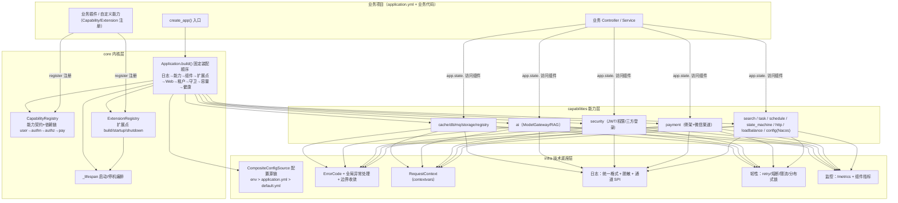

# flower web 通用框架 · 系统架构

> 面向源码钻研者的框架总体架构说明书：三层结构（core/infra/capabilities）的职责边界与依赖规则、顶层导出与惰性导入、配置体系、组件装配、生命周期与通用设计模式，末尾附包结构全景图。

## 目录

- [1. 三层总体结构](#1-三层总体结构)
  - [1.1 职责边界](#11-职责边界)
  - [1.2 依赖规则与分层理由](#12-依赖规则与分层理由)
  - [1.3 顶层导出约定与惰性导入](#13-顶层导出约定与惰性导入)
- [2. 配置体系架构](#2-配置体系架构)
  - [2.1 CompositeConfigSource 配置源链](#21-compositeconfigsource-配置源链)
  - [2.2 Settings 门面](#22-settings-门面)
  - [2.3 application.default.yml 权威默认](#23-applicationdefaultyml-权威默认)
  - [2.4 环境变量占位符解析](#24-环境变量占位符解析)
  - [2.5 .env 包导入加载时序](#25-env-包导入加载时序)
- [3. 组件装配架构](#3-组件装配架构)
  - [3.1 Application.build() 固定装配顺序](#31-applicationbuild-固定装配顺序)
  - [3.2 组件注册表 *Registry 模式](#32-组件注册表-registry-模式)
  - [3.3 中间件注册表](#33-中间件注册表)
  - [3.4 app.state 组件挂载](#34-appstate-组件挂载)
- [4. 生命周期](#4-生命周期)
  - [4.1 lifespan 启动/停机编排](#41-lifespan-启动停机编排)
  - [4.2 优雅停机等待窗口](#42-优雅停机等待窗口)
  - [4.3 扩展点钩子顺序](#43-扩展点钩子顺序)
- [5. 通用设计模式](#5-通用设计模式)
  - [5.1 SPI + 注册表模式](#51-spi--注册表模式)
  - [5.2 模板方法：PaymentChannelTemplate](#52-模板方法paymentchanneltemplate)
  - [5.3 状态枚举：get_code / of / description](#53-状态枚举get_code--of--description)
  - [5.4 contextvars 请求上下文](#54-contextvars-请求上下文)
- [6. 包结构全景图](#6-包结构全景图)
- [7. 总体架构图](#7-总体架构图)

## 1. 三层总体结构

`web_infra` 包（2026-08-18 v1.0.0 破坏性整改后）按职责分三层组织，顶层导出保持不变（`from web_infra import Result, create_app` 等不受影响），但子包路径已迁移至三层。

### 1.1 职责边界

| 层 | 包路径 | 职责 | 内容 |
| ---- | ---- | ---- | ---- |
| **内核 core** | `web_infra.core` | 应用编排与扩展点契约 | `application.py`（`Application` / `create_app`）、`capability/`（能力注册表）、`extension/`（统一扩展注册器） |
| **技术底座 infra** | `web_infra.infra` | 被所有能力共用的基础设施 | `result`（统一响应）、`error`（错误码/异常/全局处理）、`constants`、`context`（请求上下文）、`logging`、`resilience`（重试/熔断/限流/分布式锁）、`monitoring`、`web`（中间件/健康检查/SSE）、`config`（本地配置）、`utils` |
| **能力层 capabilities** | `web_infra.capabilities` | 相互独立、可裁剪的业务能力 | `ai` / `cache` / `db` / `mq` / `storage` / `registry` / `security` / `payment` / `search` / `state_machine` / `task` / `schedule` / `http`（Feign）/ `loadbalance` / `config`（Nacos 配置中心接入）/ `capacity` |

### 1.2 依赖规则与分层理由

- **core 只做组织**：内核层不依赖任何具体能力实现，只持有装配流程（`Application.build`）与扩展契约（`Capability` / `ExtensionPoint`）。所有可替换实现经 SPI 接口 + 注册表在能力层注册，core 通过注册表按配置按名装配，因此核心逻辑与具体中间件解耦。
- **infra 被共用**：技术底座是"无环依赖的底层"，能力层与 core 都引用它（如 `web_infra.infra.error`、`web_infra.infra.context`、`web_infra.infra.monitoring`）。infra 内部禁止反向依赖 capabilities，否则将形成环。
- **capabilities 相互独立可裁剪**：每个能力是一个独立包，只依赖 infra 底座与自身 SPI；能力之间不互相 import（跨能力协作经注册表/配置，如 `ModelConfigStore` 复用 db 组件的 `session_factory`，靠的是「可选能力探测」而非硬编码依赖，见 `_build_ai_model_store`）。因此能力可按 extras 按需裁剪安装，未安装的能力不加载（延迟导入）。

依赖方向示意：

```ascii
        ┌────────────────────────────┐
        │   capabilities 能力层      │   相互独立、可裁剪（extras 按需安装）
        │  ai cache db mq storage    │
        │  registry security payment │
        │  search task http ...      │
        └─────────────┬──────────────┘
                      │ 依赖
        ┌─────────────▼──────────────┐
        │   infra 技术底座（共用）     │   result/error/context/logging/
        │                            │   resilience/monitoring/web/config
        └─────────────┬──────────────┘
                      │ 依赖
        ┌─────────────▼──────────────┐
        │   core 内核（组织编排）      │   Application/create_app
        │   capability / extension   │   CapabilityRegistry/ExtensionRegistry
        └────────────────────────────┘
```

### 1.3 顶层导出约定与惰性导入

`web_infra/__init__.py` 是包入口，兼顾「最小安装（零可选依赖）可导入」与「全量能力可 `import *`」两个目标：

1. **立即导入**：`result / error / context / logging / resilience / web / config（本地）/ constants / 工具类 / 全部 SPI 接口与注册表 / 内存实现` 等核心符号在包导入时直接加载。
2. **惰性导出（`_LAZY_DB_EXPORTS`）**：依赖 `sqlalchemy / redis / pymongo / beanie` 的实现名（`Base`、`MySQLConfig`、`MySQLDatabase`、`MongoDBConfig`、`BeanieMongoSession`、`MongoDatabase`、`RedisConfig`、`RedisCacheBackend`、`TenantAwareMixin`、`TenantQueryFilter`、`DatabaseManager`）不进 `__all__`，且由模块级 `__getattr__` 兜底：

```python
def __getattr__(name: str) -> object:
    """惰性导出 db 相关名字：首次访问时从 web_infra.capabilities.db 导入并缓存到模块命名空间。"""
    if name in _LAZY_DB_EXPORTS:
        value = getattr(import_module("web_infra.capabilities.db"), name)
        globals()[name] = value
        return value
    raise AttributeError(f"module {__name__!r} has no attribute {name!r}")
```

   首次访问 `web_infra.MySQLConfig` 时才触发 `web_infra.capabilities.db` 的导入，未安装对应 extras 时抛出 `ImportError`。已导入结果缓存进模块命名空间（`globals()[name] = value`），后续访问走常规属性查找。

3. **动态扩展 `__all__`（`_extend_all_with_installed`）**：`_LAZY_ALL_REQUIRES` 声明每个惰性名依赖的第三方包；包导入末尾调用 `_extend_all_with_installed()`，用 `importlib.util.find_spec`（不实际导入）探测依赖是否已安装，已安装的惰性名追加进 `__all__`。这样：
   - 最小安装下 `from web_infra import *` 不触发可选依赖加载；
   - 非最小安装（已装 extras）下 `import *` 自动导出全部能力（含 ORM/Redis/Mongo 组件）。

4. **包导入即加载 `.env`**：`__init__.py` 顶部先 `from web_infra.infra.config.config_utils import load_env_file` 并立即执行 `load_env_file()`，保证 `SnowflakeUtil` / `LocalObjectStorage` / `TokenCounter` 等模块级环境变量读取（`SNOWFLAKE_WORKER_ID` / `LOCAL_STORAGE_PRESIGN_SECRET` / `LLM_MODEL_RESOURCE_DIR`）在包导入时就能拿到 `.env` 中的值（详见 [§2.5](#25-env-包导入加载时序)）。

## 2. 配置体系架构

### 2.1 CompositeConfigSource 配置源链

统一配置源抽象为 `ConfigSourceInterface`（`Protocol`，`get(key, default)` / `contains(key)`）。`CompositeConfigSource` 按传入顺序聚合多个源，**越靠前优先级越高**：

```python
# Settings.default_source()（infra/config/settings.py）
return CompositeConfigSource(
    EnvConfigSource(),                      # ① 环境变量（优先级最高）
    YamlConfigSource("application.yml"),    # ② 项目根 application.yml
    YamlConfigSource(_DEFAULT_CONFIG_PATH), # ③ 框架默认 application.default.yml
    DictConfigSource(),                     # ④ 空字典源（占位，可注入）
)
```

- `EnvConfigSource`：点分隔 key（`app.db.mysql.host`）映射为环境变量名 `APP_DB_MYSQL_HOST`（`_to_env_name`：`.`→`_` 并大写，前缀 `APP_`）。
- `YamlConfigSource`：延迟加载 YAML（首次 `get`/`contains` 才读盘），加载时递归解析 `${ENV_VAR}` / `${ENV_VAR:default}` 占位符；文件不存在视为空字典（`{}`），不抛错。
- `DictConfigSource`：内存字典源，业务代码可注入覆盖。
- `_DEFAULT_CONFIG_PATH` 为包内 `application.default.yml`（`Path(__file__).parent / "application.default.yml"`），随发行包携带。

`create_app(settings)` 传 dict 时，`Application._resolve_settings` 构造 `Settings(CompositeConfigSource(DictConfigSource(settings), Settings.default_source()))`——dict 覆盖层置于最前，优先级最高。

### 2.2 Settings 门面

`Settings` 是统一配置读取门面（`infra/config/settings.py`），业务与装配代码只依赖它，屏蔽底层源差异：

- 便捷读取：`get` / `get_required`（缺失抛 `ConfigError`）/ `get_int` / `get_float` / `get_bool`（`true/1/yes/on`）/ `get_list`（支持 JSON 数组或逗号分隔）。
- 环境标识（规范 §19.3 显式环境）：`APP_ENV` 环境变量 > 配置 `app.env` > 默认 `"dev"`（未指定/非法值按 `dev` 兜底并 `warning`，合法集合 `ENVIRONMENTS = {"dev", "test", "stage", "prod"}`）；`app_env` 属性 + `is_production()`（生产行为开关）。
- 全局实例：`Settings.instance()`（未配置时用 `default_source()` 构造并缓存）、`Settings.configure(source)` 显式设置。

### 2.3 application.default.yml 权威默认

框架全部默认值统一收敛于 `infra/config/application.default.yml`，**禁止在 `application.py` 内嵌默认值**（装配代码中仅保留少量 `or "memory"` 式的兜底）。关键默认段：

- `app.name` / `app.version`、`app.logging`（`format: text`、`output: both`、`retention_days: 30`、`sinks: {}`）
- `app.capabilities.enabled: []`、`app.extensions.enabled: []`（可选能力/扩展点默认全关）
- `app.web.middlewares`（`trace_id: {}` 默认引入；`auth` / `idempotency` / `security_headers` 默认 `enabled: false`）、`app.web.cors`
- `app.tenant.enabled: false`、`app.ai.enabled: false`、`app.mongo.enabled: false`、`app.search.enabled: false`、`app.capacity.enabled: false`
- 组件 type 默认：`cache.type: memory`、`db.type: mysql`、`storage.type: local`、`mq.type: memory`、`registry.type: memory`、`payment.type: memory`
- 敏感项一律 `${APP_*_*:default}` 引用环境变量（如 `password: ${APP_DB_MYSQL_PASSWORD:}`），默认空字符串兜底。

### 2.4 环境变量占位符解析

`config_utils.resolve_env_placeholders(data)` 递归处理 dict/list/str 中的 `${ENV_VAR}` 与 `${ENV_VAR:default}` 占位符（正则 `_ENV_PLACEHOLDER_PATTERN`）：

- 环境变量已定义 → 取其值；
- 未定义但有默认值 → 取默认值（如 `${APP_LOGGING_FILE:logs/app.log}`）；
- 未定义且无默认值 → 保留原样（如 `${APP_DB_MYSQL_PASSWORD:}` 无默认值部分为空串）。

敏感配置（数据库密码、Redis 密码、MinIO/Nacos 密钥等）经此机制注入，避免明文随 yml 提交仓库。

### 2.5 .env 包导入加载时序

`.env` 的加载有**两处时机**，设计上是「先包级、后门面级」的递进：

```ascii
web_infra 包导入
   │
   ├─ ① load_env_file()                     （__init__.py 顶部，2026-08-17 新增）
   │     加载项目根 .env 到 os.environ（override=False 不覆盖已存在变量）
   │     → 模块级环境变量读取（SnowflakeUtil/LocalObjectStorage/TokenCounter）
   │       在包导入时即可拿到 .env 的值
   │
   └─ create_app() → Settings.default_source()
         │
         └─ ② load_env_file()               （幂等，已加载的变量不被覆盖）
               → 后续 YamlConfigSource 解析 ${ENV:default} 占位符时
                 读取到 .env 中的敏感值
```

- **为什么包导入就要加载**：`SnowflakeUtil`（读 `SNOWFLAKE_WORKER_ID`）、`LocalObjectStorage`（读 `LOCAL_STORAGE_PRESIGN_SECRET`）、`TokenCounter`（读 `LLM_MODEL_RESOURCE_DIR`）等模块在**包导入期**读取环境变量；若等到 `create_app` 的 `Settings.default_source()` 才加载 `.env`，这些值恒为默认（如雪花 worker_id 恒为 0 并告警）。
- `load_env_file` 用 `python-dotenv` 的 `load_dotenv(dotenv_path=".env", override=False)`：进程/容器注入的环境变量优先，不被 `.env` 覆盖；未安装 python-dotenv 时 warning 降级（不阻断）。

## 3. 组件装配架构

### 3.1 Application.build() 固定装配顺序

`Application`（`core/application.py`）构造时创建 `FastAPI(title, version, lifespan=self._lifespan)`；`build()` 按固定顺序装配，**顺序本身即依赖约束**：

```python
def build(self) -> FastAPI:
    self._setup_logging()          # ① 日志：格式/通道/脱敏（业务日志先行就绪）
    self._setup_capabilities()     # ② 能力：app.capabilities.enabled 校验并按拓扑序启用
    self._setup_components()       # ③ 组件：cache/db/storage/mq/registry/ai[/mongo]
    self._setup_extensions()       # ④ 扩展点：app.extensions.enabled 拓扑序构建实例
    self._setup_web()              # ⑤ Web：全局异常 + 中间件（可复用已装配组件）
    self._setup_tenant()           # ⑥ 多租户：租户条件过滤器挂载数据库会话
    self._setup_diagnostic_guard() # ⑦ 诊断端点访问守卫（/capacity 与 /metrics 共用）
    self._setup_capacity()         # ⑧ 容量评估（可选，app.capacity.enabled）
    self._setup_health()           # ⑨ 健康检查三端点 + /metrics 指标端点
    return self.app
```

装配顺序的关键设计：

- **组件先于中间件**：依赖框架组件的中间件（如幂等存储 `store_type=redis` 复用 cache 组件的 Redis 客户端）在装配期可取得已装配组件（`ctx["components"]`）。
- **扩展点（插件）在组件之后、中间件之前**：插件 `build` 可复用已装配组件，插件注入的实例同样可被中间件装配复用。
- `create_app(settings=None, **kwargs)` 是便捷入口：`Application(settings, **kwargs).build()`。

各组件构建均经对应注册表按 `app.<x>.type` 按名装配（`_resolve_registry` 未注册即 `ConfigError` 快速失败）：

| 组件 | 构建方法 | type 配置键 | 默认 | 注册表 |
| ---- | ---- | ---- | ---- | ---- |
| 缓存 | `_build_cache` | `app.cache.type` | memory | `CacheBackendRegistry` |
| 数据库 | `_build_db` | `app.db.type` / `app.db.instances` | mysql | `DatabaseRegistry` |
| 对象存储 | `_build_storage` | `app.storage.type` | local | `ObjectStorageRegistry` |
| 消息队列 | `_build_mq` | `app.mq.type` | memory | `MessageQueueRegistry` |
| 注册发现 | `_build_registry` | `app.registry.type` | memory | `ServiceDiscoveryRegistry` |
| AI 网关 | `_build_ai` | `app.ai.enabled=true` 时 | — | `ModelConfigStoreRegistry` + `ModelProviderRegistry` |
| MongoDB | `_build_mongo` | `app.mongo.enabled=true`、`app.mongo.type` | beanie | `MongoDatabaseRegistry` |

`_build_db` 支持三种形态：单源（`app.db.type`）、混合多数据源（`app.db.instances`，每实例带 `type`，装配为 `DatabaseManager`）、多租户独立库（`app.db.mysql.instances`，向后兼容，无 type 缺省回落 mysql）。`_build_ai` 中 `store.type=db` 时经 `_build_ai_model_store` 复用数据库组件 `session_factory`（mysql）或为 sqlite 构建独立 aiosqlite 引擎，拿不到异步会话工厂时装配快速失败。

### 3.2 组件注册表 *Registry 模式

所有可替换组件统一采用「**类级注册表**：接口 + 默认实现 + 生产实现 + 按 type 装配快速失败」：

```ascii
                       接口（SPI，Protocol/ABC）
                              ▲
        ┌─────────────────────┼─────────────────────┐
        │                     │                     │
   默认实现（内存/本地）    生产实现（Redis/MQ/...）   业务自定义实现
        │                     │                     │
        └─────────────┬───────┴─────────┬───────────┘
                      ▼                 ▼
              Registry.register(name, factory)   （模块导入即注册，幂等）
                      │
                      ▼
        Application._build_* → _resolve_registry(Registry, type, key)
                      │
                      └── 未注册 type → ConfigError 快速失败（不静默回落）
```

- 注册表为**类级**（类属性存储 + `threading.Lock` 保护并发 register），如 `CacheBackendRegistry`、`DatabaseRegistry`、`MongoDatabaseRegistry`、`ObjectStorageRegistry`、`MessageQueueRegistry`、`ServiceDiscoveryRegistry`、`ModelConfigStoreRegistry`、`SearchEngineRegistry`、`LogSinkRegistry`、`PaymentGatewayRegistry`、`ModelProviderRegistry`（实例级）。
- 工厂签名按能力约定：缓存/存储/MQ/注册中心 `(settings) -> 实现`；数据库 `(连接参数 dict) -> 工厂`；模型配置来源 `() -> store`。
- `_resolve_registry` 捕获 `KeyError` 转为 `ConfigError`（提示内置清单与自定义注册方式），**避免拼写错误/未注册类型静默回落默认实现**——这是「未注册快速失败」原则的落地。

### 3.3 中间件注册表

中间件同样配置驱动：`_MIDDLEWARE_REGISTRY`（模块级 dict）登记「name → (中间件类, 构造参数构建器)」，构建器签名 `(options, ctx)`，`ctx` 携带 `{"settings", "components"}`：

| name | 中间件类 | 说明 |
| ---- | ---- | ---- |
| `trace_id` | `TraceIdMiddleware`（= `RequestContextMiddleware` 别名） | 默认引入，且必须最后声明（最先执行生成 TraceId） |
| `auth` | `AuthMiddleware` | 默认关闭；白名单放行 + Bearer 校验 + 身份注入 |
| `rate_limit` | `RateLimitMiddleware` | 按 qps/burst/key_by 限流 |
| `idempotency` | `IdempotencyMiddleware` | 幂等键 + 请求摘要 + 结果缓存；store 由 `_build_idempotency_store` 按 `store_type`（memory/redis）构建，redis 需已装配 Redis 缓存组件 |
| `security_headers` | `SecurityHeadersMiddleware` | 安全响应头（整改 S25-1），默认关闭 |

`_setup_web` 遍历 `app.web.middlewares`：`False` 或 `enabled: false` 跳过；未注册的中间件名抛 `ConfigError`。**执行顺序与声明顺序相反**（Starlette 后声明者在外层先执行）：默认配置声明 `idempotency → auth → security_headers → trace_id`，实际执行顺序为 `trace_id → security_headers → auth → idempotency`，保证 TraceId 最先生成、身份在幂等层之前注入。

### 3.4 app.state 组件挂载

`_setup_components` 装配完成后统一挂载到 `app.state`：

- `app.state.components = self._components`（name → 组件实例字典）；
- 每个组件 `setattr(self.app.state, name, component)`，即 `app.state.cache` / `app.state.db` / `app.state.storage` / `app.state.mq` / `app.state.registry` / `app.state.ai`（启用时）`/ app.state.mongo`；
- `app.state.settings = self.settings`（业务/组件装配期读取统一配置）；
- 扩展点装配后 `app.state.extensions`（name → 插件实例，见 [02-扩展机制.md](./02-扩展机制.md)）；
- 容量评估启用后 `app.state.capacity`。

业务侧统一经 `app.state.<name>` 访问已装配组件（见 [使用说明.md §3](../使用说明.md#3-配置说明)）。

## 4. 生命周期

### 4.1 lifespan 启动/停机编排

`Application._lifespan`（`@asynccontextmanager`）在 FastAPI 启动/停机时按序编排：

```python
async def _lifespan(self, app):
    RequestContext.clear()                              # 启动前清理上下文
    setup_uvicorn_access_log(self.app)                  # 接管 uvicorn 访问日志（避免重复）
    await self._register_ai_models_from_store()         # 模型配置来源（db/自定义）注册到 SPI 注册表
    await self._run_extension_startups()                # 扩展点 startup 钩子（拓扑序）
    await self._start_capacity_sampler()                # 容量采样任务启动
    yield                                               # 应用运行期
    await self._stop_capacity_sampler()                 # 容量采样任务停止
    await self._run_extension_shutdowns()               # 扩展点 shutdown 钩子（逆拓扑序）
    await self._shutdown()                              # 优雅停机（等待窗口 + 组件 close）
```

- `setup_uvicorn_access_log`：装配了访问日志中间件时关闭 uvicorn 原生 access log，由中间件输出唯一访问日志；自定义 lifespan 下 Starlette 不执行 router 的 on_startup 事件，故在此显式调用。
- `_register_ai_models_from_store`：`app.ai.store.type=db` 或自定义来源时全量加载并自动同步供应商注册表；注册失败仅记 error 日志**不阻断启动**（模型调用回落 `E4-AI-001` 明确错误）。

### 4.2 优雅停机等待窗口

`_shutdown` 遵循规范 §19.2「摘流量 → 等待窗口 → 连接排空 → 优雅退出」：

```python
wait_seconds = float(self.settings.get_float("app.graceful_shutdown_wait_seconds", 0.0) or 0.0)
if wait_seconds > 0:
    await asyncio.sleep(wait_seconds)          # 等待窗口：存量请求排空
for component in self._components.values():
    method = getattr(component, "close", None) or getattr(component, "stop", None)
    if callable(method):
        result = method()                      # 同步/异步皆可
        if inspect.isawaitable(result):
            await result
```

- **摘流量**由部署层完成（K8s preStop / 注册中心下线），`/health/ready` 就绪探针随组件关闭自然返回 DOWN；
- **等待窗口** `app.graceful_shutdown_wait_seconds` **默认 0**（保持旧行为与测试兼容），生产环境建议配置 ≥10s（见 [04-设计决策.md](./04-设计决策.md) 决策 12）；
- 组件关闭：优先取 `close`，其次 `stop`，按组件装配顺序依次释放（数据库连接池、Redis、MQ 等）。

### 4.3 扩展点钩子顺序

扩展点（`ExtensionRegistry`，插件协议）生命周期钩子与框架组件的关系：

```ascii
启动：build（装配期，拓扑序构建实例）
      → startup 钩子（拓扑序，前置先启动）
      → 框架组件正式对外服务
停机：扩展点 shutdown 钩子（逆拓扑序，后启先停）
      → 框架组件 close（插件可能依赖框架组件，先用完再关底层）
```

同步/异步钩子皆可（返回 awaitable 自动 await）；钩子异常不吞，启动失败即应用启动失败（与组件装配一致）。详见 [02-扩展机制.md §3](#)。

## 5. 通用设计模式

### 5.1 SPI + 注册表模式

框架全部可替换点遵循同一模式：**定义扩展接口（SPI）承载差异化逻辑 → 注册表显式注册 → 配置声明装配 → 未注册快速失败**。接口文件统一命名 `<职责>_interface.py`，类型为 `Protocol`（结构子类型，无需继承）或 `ABC`（需继承实现）。每个扩展点必须有默认实现，核心功能不因扩展缺失而失效。完整清单见 [SPI-Extensions.md §2](../SPI-Extensions.md#2-接口总览)。

### 5.2 模板方法：PaymentChannelTemplate

支付渠道层用 Template Method 固化资金流程骨架（`capabilities/payment/payment_channel_template.py`）：

- **final 入口不可覆写**：`prepay` / `refund` / `close_order` / `handle_callback` / `validate_callback`；
- **必选抽象（漏实现无法实例化）**：`_do_prepay` / `_do_query_order` / `_do_close_order` / `_parse_callback`；
- **可选能力（默认抛 `E4-PAY-008`）**：`_do_refund` / `_do_query_refund`，与 `capabilities` 能力位声明配合（`_supports` 运行期拦截未声明能力）；
- **骨架统一编排兜底**：下单幂等（`_check_idempotency`）→ 渠道调用 → 三态收敛（`SUCCESS/FAILED/UNKNOWN`）→ 流水落库（`_persist_flow`）；关单前查单确认（§5.5）；回调金额/attach/状态机强校验（`_verify_and_check`）；依赖注入 `flow_store`/`order_store`/`audit_store`，未注入降级为纯渠道调用。

渠道实现方（如 `WeChatPayProvider`）只填充 `_do_*`，资金安全流程全部由骨架保证。

### 5.3 状态枚举：get_code / of / description

框架所有可持久化状态枚举统一实现「**入库存 code、未知码校验、中文描述**」三件套（规范 §5.2：入库存 code 禁存枚举名），以 `OutboxStatus` 与 `CircuitBreakerState` 为模板：

```python
class OutboxStatus(IntEnum):
    PENDING = 0  # 待发送
    SENT = 1     # 已发送
    FAILED = 2   # 失败超限
    DLQ = 3      # 死信

    def get_code(self) -> int | str:   # 入库 code（不存枚举名）
        return int(self.value)

    @classmethod
    def of(cls, code: int | str):      # 按 code 反查成员；未知 code 抛 ValueError
        for member in cls:
            if member.value == code:
                return member
        raise ValueError(f"未知的 {cls.__name__} code: {code!r}")

    @property
    def description(self) -> str:      # 中文描述（未收录返回空串）
        return _DESCRIPTIONS.get(self.name, "")
```

同样模式的枚举：`CircuitBreakerState`（CLOSED/OPEN/HALF_OPEN）、支付状态机（`PaymentStatus` / `PaymentFlowStatus`）、`UploadStatus`、`TaskStatus`、`TokenVerifyStatus` 等。

### 5.4 contextvars 请求上下文

`RequestContext`（`infra/context/request_context.py`）基于 `contextvars.ContextVar` 承载链路信息（TraceId / user_id / scope / client_id / service_id / tenant_id），**自动随 asyncio 任务传递**；跨线程（线程池）需显式 `snapshot()` / `restore()`：

- `set_*` / `get_*`（`get_user_id` 无上下文回落 `ANONYMOUS_USER` 占位，统一管理于 `SysConstant`）；
- `snapshot()` 导出 `RequestContextSnapshot`（提交异步任务时携带），`restore()` 在子线程/子任务入口恢复；
- `clear()` 清空全部（请求结束调用防泄漏）；`as_dict()` 导出透传请求头（`X-Trace-Id` / `X-User-Id` / `X-Tenant-Id` 等）；
- `generate_trace_id()` 生成 UUID4 hex 链路唯一标识。

中间件在请求入口注入（`RequestContextMiddleware` 透传/生成 TraceId，`AuthMiddleware` 以 token payload 覆盖身份），请求结束 `finally` 中 `clear()`。

## 6. 包结构全景图

```ascii
src/web_infra/
├── __init__.py                  # 顶层导出：惰性导入(_LAZY_DB_EXPORTS/__getattr__) +
│                                #   __all__ 动态扩展(_extend_all_with_installed) + .env 预加载
├── core/                        # ── 内核（应用编排与扩展点契约）
│   ├── application.py           # Application / create_app（装配 + 生命周期）
│   ├── capability/              # 能力注册表：Capability / CapabilityRegistry /
│   │                            #   CapabilityResolution / CapabilityValidation /
│   │                            #   CapabilityError / builtin_capabilities（内置依赖图）
│   └── extension/               # 统一扩展注册器：ExtensionPoint / ExtensionRegistry /
│                                #   ExtensionResolution / ExtensionValidation / ExtensionError
├── infra/                       # ── 技术底座（被所有能力共用）
│   ├── config/                  # 配置：ConfigSourceInterface / CompositeConfigSource /
│   │                            #   Settings / EnvConfigSource / YamlConfigSource /
│   │                            #   DictConfigSource / JsonFileConfigSource / config_cipher /
│   │                            #   config_utils（占位符解析 + .env 加载）/ application.default.yml
│   ├── constants/               # 常量：auth_constant / biz_constant / cache_key /
│   │                            #   http_status_constant / infra_constant / param_constant / sys_constant
│   ├── context/                 # RequestContext / RequestContextSnapshot（contextvars）
│   ├── error/                   # ErrorCode / ErrorCodeRegistry / CommonErrorCode /
│   │                            #   异常（BizException/ParamException/PermException/AuthException）/
│   │                            #   handler（全局异常处理 + 边界收敛）/ 各域错误码
│   ├── logging/                 # configure_logging / get_logger / ContextFilter /
│   │                            #   JsonFormatter / SensitiveDataFilter（脱敏）/
│   │                            #   LogSinkInterface / LogSinkRegistry（Console/File 内置）
│   ├── monitoring/              # metrics（Prometheus）/ metrics_html / phase_timer / slo /
│   │                            #   各组件指标（cache/mq/payment/ai/storage/registry/pool/runtime）/
│   │                            #   MetricGroupProviderInterface + Registry / slow_request_store
│   ├── resilience/              # retry（指数退避）/ CircuitBreaker（+Config/StateEnum/OpenError）/
│   │                            #   TokenBucketRateLimiter / RateLimitConfig / DistributedLock
│   ├── result/                  # Result / PageResult / PageData（统一响应结构）
│   ├── utils/                   # DateUtil / TimezoneConfig / SnowflakeUtil / FileLock /
│   │                            #   DataUtil / MathUtil / PdfRenderer / TokenCounter / ip_address_util
│   ├── web/                     # 中间件（request_context/trace_id/auth/rate_limit/idempotency/
│   │                            #   logging/security_headers）+ json_response(BigInt) +
│   │                            #   health(live/ready/metrics) + cors + sse + diagnostic_access +
│   │                            #   idempotency_store（InMemory/Redis）
│   └── __init__.py
└── capabilities/                # ── 能力层（相互独立、可裁剪）
    ├── ai/                      # 模型网关（model_gateway：ModelGateway/ModelRouter）/
    │   │                        #   provider（OpenAICompatibleProvider）/
    │   │                        #   connection_pool / concurrency / quota /
    │   │                        #   prompt / retrieval（chunker/embedding/vector_store/
    │   │                        #   reranker/retriever/ElasticsearchVectorStore）/
    │   │                        #   model_config_store（Dict/SQLAlchemy）+ 注册表 / 审核 / 缓存
    ├── cache/                   # CacheBackendInterface / MemoryCacheBackend / RedisCacheBackend /
    │                            #   CacheBackendRegistry / KeyBuilder / TenantKeyBuilder / CacheConfig
    ├── capacity/                # 容量评估：CapacityAssessor / StaticEstimator / RuntimeSampler /
    │                            #   RemoteProbe / capacity_endpoint / cli / report / metrics
    ├── config/                  # Nacos 配置中心：ConfigClientInterface / NacosConfigClient /
    │                            #   NacosConfigLoader / NacosProperties / nacos_client_factory
    ├── db/                      # 数据访问：DatabaseFactoryInterface / DatabaseRegistry /
    │                            #   MySQLDatabase / MySQLConfig / SqliteSession(+Factory) /
    │                            #   DatabaseManager（多数据源）/ TenantDatabaseRouter /
    │                            #   SessionScopeMixin / SqlAlchemyDatabaseSession /
    │                            #   RedisCacheBackend / MongoDB（MongoDatabase/BeanieMongoSession/
    │                            #   MongoDatabaseRegistry）/ read_write_router / page_query /
    │                            #   tenant_guard / tenant_query_filter / session_dependency
    ├── http/                    # FeignClient / FeignClientFactory（服务发现+负载均衡+熔断降级）
    ├── loadbalance/             # LoadBalancerInterface / Random / RoundRobin / WeightedRoundRobin
    ├── mq/                      # MessagePublisherInterface / MessageConsumerInterface /
    │   │                        #   MessageQueueRegistry / InMemoryMessageQueue / RocketMqPublisher /
    │   │                        #   idempotent_consumer / retryable_consumer / message_queue_selector
    │   └── outbox/              # Outbox：OutboxStoreInterface / InMemoryOutboxStore /
    │                            #   MysqlOutboxStore / OutboxPublisher（退避+DLQ）/ OutboxCleaner /
    │                            #   OutboxStatus / DlqConsumer / outbox_task_registrar
    ├── payment/                 # 支付（可选能力，不随顶层导出）：PaymentGateway(+Registry) /
    │   │                        #   PaymentChannelTemplate（模板方法骨架）/ 回调验签+分发 /
    │   │                        #   流水/订单存储 SPI + 状态机 / 风控(risk) / 对账(reconciliation) /
    │   │                        #   审计 / 冲正 / 测试(testing：契约用例+回调模拟器)
    │   └── provider/wechat/     # WeChatPayProvider / WeChatPayClient(APIv3) /
    │                            #   WeChatCallbackVerifier / WeChatSigner / WeChatCertificateStore
    ├── registry/                # ServiceRegistryInterface / InMemoryServiceRegistry /
    │                            #   NacosDiscoveryClient / NacosRegistration /
    │                            #   ServiceDiscoveryRegistry / ServiceInstance
    ├── schedule/                # TaskScheduler（分布式锁防重复）/ ScheduledTask
    ├── search/                  # SearchEngineInterface / SearchEngineRegistry /
    │                            #   InMemorySearchEngine / ElasticsearchSearchEngine / SearchQuery/Hit
    ├── security/                # JWTUtil / JwtKeyProvider / JwtTokenStore / PasswordEncoder /
    │   │                        #   验证码(CaptchaStore/Service) / LoginFailLock / PermissionGuard /
    │   │                        #   PrivacyGuard(PII) / SecureConfigLoader / data_permission /
    │   │                        #   oauth2(OAuth2Client/OAuth2TokenService)
    │   └── social/              # 三方登录：SocialPlatform / SocialPlatformRegistry /
    │                            #   SocialLoginService / DemoSocialPlatform / binding store
    ├── state_machine/           # 通用状态机：BaseState/BaseEvent/BaseStatus/StateMachine/
    │                            #   StateMachineEngine / StateMachineRegistry / StateRouter
    ├── storage/                 # ObjectStorageInterface / ObjectStorageRegistry /
    │   │                        #   LocalObjectStorage / MinioStorage / MinioStorageConfig
    │   └── upload/              # 分片上传：MultipartUploadService / PartStorageInterface /
    │                            #   Local/MinioPartStorage / UploadStoreInterface / UploadTask
    ├── task/                    # TaskExecutor / TaskRecord / TaskRecordStoreInterface /
    │                            #   InMemoryTaskRecordStore / shared_thread_pool
    └── __init__.py
```

## 7. 总体架构图



相关文档：[扩展机制](./02-扩展机制.md)、[核心流程导读](./03-核心流程导读.md)、[设计决策](./04-设计决策.md)、[SPI-Extensions.md](../SPI-Extensions.md)、[使用说明.md](../使用说明.md)。
